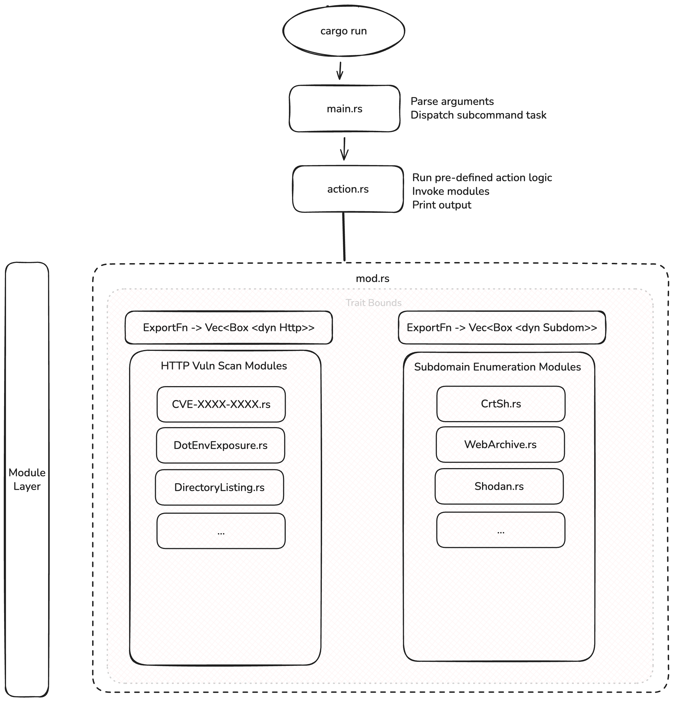

# Vulnscan 🦀

A high-performance, asynchronous CLI tool architected for efficient web vulnerability discovery.

Designed as a proof-of-concept for managing high-throughput network I/O and complex futures orchestration in Rust.

## Features

This tool implements a multi-stage security pipeline: starting with passive reconnaissance via Certificate Transparency (CT) logs, followed by high-speed concurrent port scanning, and concluding with a specialized HTTP module to identify common web misconfigurations and vulnerabilities.

- **Passive Reconnaissance**: Retrieves subdomains from `crt.sh` (Certificate Transparency logs) and `web.archive.org` (Wayback Machine).
- **Async Port Discovery**: Powered by `tokio`, capable of scanning thousands of ports concurrently without thread starvation.
- **Web Vulnerability Analysis**: Detects common web flaws by resolving HTTP responses.

## Architecture 



## Usage

```shell
cargo run --release -- help
```

```text
Usage: vulnscan <COMMAND>

Commands:
  modules  
  scan     
  help     Print this message or the help of the given subcommand(s)

Options:
  -h, --help  Print help
```

### List Available Modules

```shell
cargo run --release -- modules
```

```text
Subdomain Modules
        subdomain/crtsh: Use crt.sh to enumerate subdomains
        subdomain/webarchive: Use web.archive.org to enumerate subdomains
HTTP Modules
        http/directory_listing: Check if directory listing is publicly accessible
        http/dotenv_disclosure: Check if .env is publicly accessible
        http/git_config_leakage: Check if .git/config is publicly accessible
        http/git_head_leakage: Check if .git/head is publicly accessible
```

### Start Scanning

```shell
cargo run --release -- scan github.com
```

```text
[2025-12-22T18:16:31Z INFO  vulnscan::action] Starting scan for github.com
[2025-12-22T18:16:37Z INFO  vulnscan::modules::subdomain::crtsh] subdomain/crtsh: Found 103 subdomains
[2025-12-22T18:16:37Z INFO  vulnscan::modules::subdomain::webarchive] subdomain/webarchive: Found 85 subdomains
103 subdomains were found during the enumeration stage
47 subdomains were successfully resolved
atom-installer.github.com
        80
        443
raw.github.com
        80
        443
ducky.github.com
        80
        443
... (skipped)
[2025-12-22T18:17:07Z INFO  vulnscan::action] Starting Web vulnerability scanning
[2025-12-22T18:17:38Z INFO  vulnscan::action] Web vulnerability scanning finished
DotEnvDisclosure("https://edu.github.com:443/.env")
Scan completed in 66.986786 seconds
```

## Run tests

```shell
>> cargo test

running 8 tests
test modules::http::dotenv_disclosure::tests::test_scan_should_return_some_when_pattern_matched ... ok
test modules::http::directory_listing::tests::test_scan_should_return_none_when_pattern_unmatched ... ok
test modules::http::git_config_leakage::tests::test_scan_should_return_none_when_pattern_unmatched ... ok
test modules::http::git_head_leakage::tests::test_scan_should_return_none_when_pattern_unmatched ... ok
test modules::http::git_head_leakage::tests::test_scan_should_return_some_when_pattern_matched ... ok
test modules::http::dotenv_disclosure::tests::test_scan_should_return_none_when_pattern_unmatched ... ok
test modules::http::git_config_leakage::tests::test_scan_should_return_some_when_pattern_matched ... ok
test modules::http::directory_listing::tests::test_scan_should_return_some_when_pattern_matched ... ok
test result: ok. 8 passed; 0 failed; 0 ignored; 0 measured; 0 filtered out; finished in 0.08s
```
